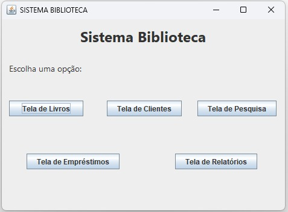
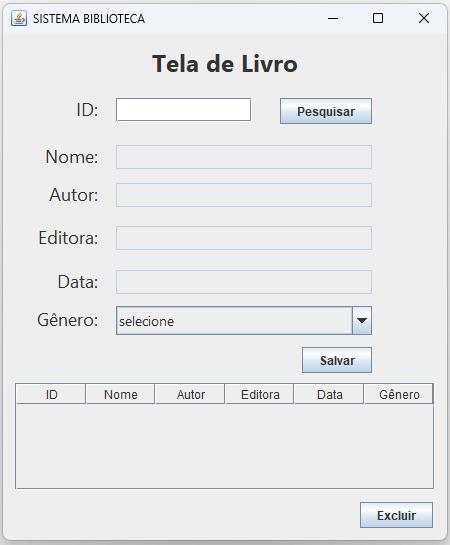
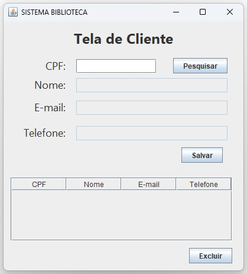
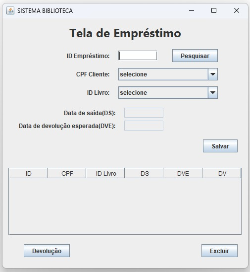
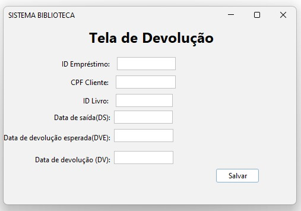
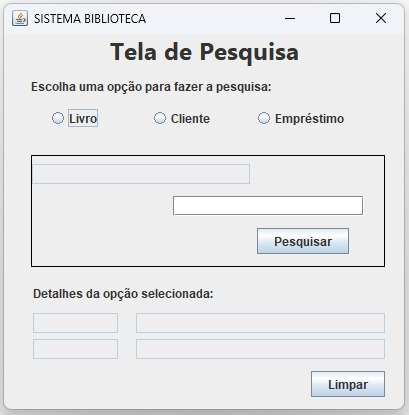
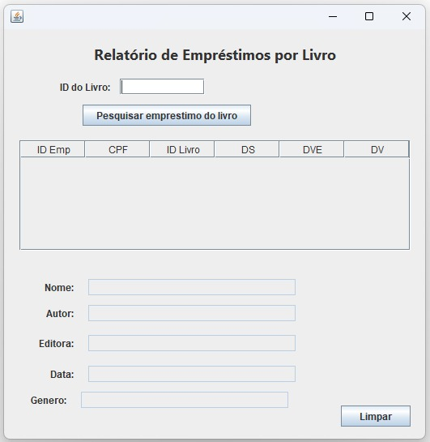

# Projeto Biblioteca em Java
Projeto desenvolvido para simular um sistema de uma biblioteca fictícia. Para isso, foram usados os coneceitos de programação orientada a objetos (POO).

O software utiliza componentes de interface gráfica da biblioteca SWING, como: Janelas/Frames (JFrame), Caixa de texto (JTextField), Caixa de combinação (JComboBox), Rótulos (JLabel), Botão de opção (JRadioButton), Botão de ação (JButton), Painel (Jpanel) e Tabelas (jTable).

## 📌 Índice
- [Funcionalidades](#-funcionalidades)
- [Layout](#-layout)
    - [Tela Principal](#-tela-principal)
    - [Tela de Livro](#-tela-de-livro)
    - [Tela de Cliente](#-tela-de-cliente)
    - [Tela de Empréstimo](#-tela-de-empréstimo)
    - [Tela de Devolução](#-tela-de-devolução)
    - [Tela de Pesquisa](#-tela-de-pesquisa)
    - [Tela de Relatório](#-tela-de-relatório)
- [Tecnologia e Ferramenta utilizadas](#tecnologia-e-ferramenta-utilizadas)
- [Autores](#-autores)

## 📋 Funcionalidades
- Cadastrar: livros, clientes, empréstimos e devoluções. 
- Alterar:  livros, clientes e empréstimos.
- Excluir: livros, clientes e empréstimos.
- Pesquisar: livros, clientes e empréstimos.
- Gerar Relatório de quantos empréstimos foram feitos com um livro.

>  Observação: todas as ações destrutivas (exclusão) são precedidas de confirmação (utilizando a classe JOptionPane).

## 🖥️ Layout

### 📂 Tela Principal

### 📂 Tela de Livro

### 📂 Tela de Cliente

### 📂 Tela de Empréstimo

### 📂 Tela de Devolução

### 📂 Tela de Pesquisa

### 📂 Tela de Relatório

## Tecnologia e Ferramenta utilizadas

 

## 📝 Autores
- Isabela Maria Leonardo
- Carolina Beltrame

